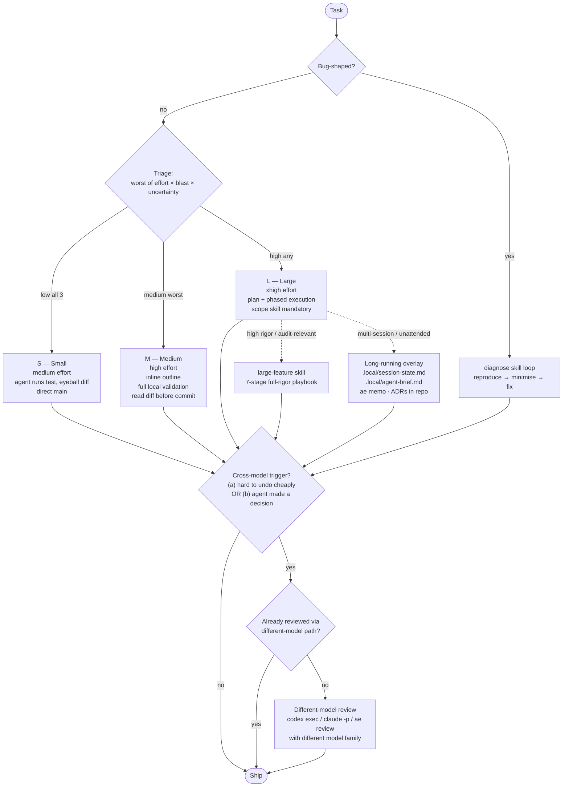

# Agentic Engineering Workflow

Operating doctrine for how to actually approach a task with an agent in this
repo. Sibling to `KNOWLEDGE.md` (field knowledge — what's true) and
`shared/AGENTS.md` (the contract symlinked into every tool — what to never
do). This file answers *what to do*.

Synthesized from the practitioner shortlist in `KNOWLEDGE.md` §18
(References / Practitioner references) and stress-tested via the
`grill-with-docs` skill. Source tier discipline (`KNOWLEDGE.md` §3) applies.

---

## At a glance

Triage every task on three dimensions, take the worst. Bug-shaped work routes
through `diagnose` regardless of size. L work with high rigor reaches for the
`large-feature` skill. Cross-model review fires on its own dual-trigger,
decoupled from the bucket — and is satisfied only by a different model family.



The rest of this file is the detail: what each bucket mandates, when triggers
fire, what counts as "different model," and the universal principles that
apply to all buckets.

---

## Triage (do this first)

Score the task on three dimensions; **take the worst**.

| Dimension | Low | Medium | High |
|---|---|---|---|
| **Effort** — reasoning load | one obvious change | normal multi-step | hard reasoning / architecture |
| **Blast radius** — cost if wrong | revert in one command | PR review catches it | prod incident or design wrong-turn |
| **Uncertainty** — can you write a one-sentence "done" definition right now without hand-waving? | yes, clean sentence | partial / some unknowns | "we'll figure out…" |

Worst dimension → bucket. **File count is not a triage criterion** — it's an outcome.

### Special triage — bug-shaped work

If the task is "something is broken / regressing / failing": route through the **`diagnose` skill** regardless of size. The structured loop (reproduce → minimise → hypothesise → instrument → fix → regression-test) prevents the guess-and-check failure mode. After `diagnose` produces a fix, re-triage the fix itself for review needs.

---

## S — Small

Hashimoto's "outsource slam dunks." Stay in minimal-harness mode.

**Must:**
- Agent runs the relevant test / lint / type check
- You eyeball the diff before committing

**Settings:**
- Effort: `medium` (`low` for truly trivial — typo, formatting)
- Skills: none forced; caveman-lite tone is enough
- Subagents: none
- Branch: direct main is fine (the "YOLO main" stance applies)

**Skip:** plans, `scope`, `/ultrareview`, cross-model — unless a trigger below fires.

---

## M — Medium

Skill-augmented single agent. Cherny's "always give Claude a way to verify."

**Must:**
- Brief inline outline in the prompt — one paragraph: what you're doing, what done looks like, how you'll know
- Agent runs full local validation (tests, lint, types — whatever the repo has)
- You read the diff before committing

**Settings:**
- Effort: `high` (Opus 4.7 default `xhigh` is also fine; never below `high`)
- Skills: domain skills as needed (load from a private overlay if applicable). Consider `code-review` after implementation for non-trivial diffs.
- Subagents: `Explore` for codebase recon *only if* the change surface is unclear
- Branch: feature branch + PR for shared repos; direct main for personal/dotfiles

**Trigger cross-model review per the rule below — not by default.**

---

## L — Large

Plan-first. Phased execution. Osmani's long-running-agents discipline.

**Must (only two):**
1. **Written plan first** — `scope` skill produces a phased plan with test gates *before* code. If `scope` feels heavy, write the equivalent to `.local/plan.md` by hand.
2. **Phased execution** — each phase ends green-or-stop. No "let me just finish this one more thing."

**Recommended before execution:**
- **Grill the plan** with the `grill-with-docs` skill (or a cross-model plan critique) — catches handwaves before they cost you code.
- **`to-issues`** if the work needs to be broken into independently-grabbable tracer-bullet slices (especially when handing off to another agent or a teammate).

**Use as needed (context-dependent):**
- **Subagent split** (planner / implementer / reviewer fan-out) if work parallelizes. Skip if you can hold the plan in your head.
- **Worktrees** if parallel tracks exist. Overkill for sequential phases.
- **ADR** if a real design decision was made (genuine alternatives, hard to reverse, surprising without context). Rare.
- **`arch-docs` update** if the change touches the living architecture (new module, new boundary, new invariant). Not for every L task.

**Settings:**
- Effort: `xhigh` for planning + most phases. Consider `max` per-session for the single hardest phase only.
- Branch: feature branch minimum. Worktree if you need to context-switch.
- Commits: per-phase. Each phase = revertable unit.

**Full-rigor option:** for L features that are multi-session, multi-slice, high blast radius, audit-relevant, or need a defensible handoff, see the **`large-feature` skill** — a 7-stage playbook covering grill → plan+critique → vertical tracer-bullet slices → per-slice red-green-refactor with phase isolation → trigger-based drift checks → integrated review → separate architecture refactor cadence. Invoke via `/large-feature` or *"use the large-feature playbook."* The lean two-mandate L shape above remains the default; the skill is the opinionated deeper path.

---

## L → Long-running mode (overlay)

When an L task spans sessions or runs unsupervised, additional patterns apply. This is the Osmani / Hashimoto long-running-agents territory — and where the multi-agent `ae` workspace shines.

**Must (additional) — repo-visible state is primary:**
- **Session-state file** in `.local/session-state.md` capturing what's done, what's in-flight, what's next. Updated at the end of each session, read at the start of the next. (`.local/` is gitignored but repo-visible.)
- **Initializer brief** in `.local/agent-brief.md` the next session reads cold. (Matt Pocock's `triage`/`AGENT-BRIEF.md` pattern is the canonical shape.)
- **Workspace handoff** via `ae memo` for shared multi-agent context (`ae memo add --topic <topic> "<fact>"`).
- **Durable decisions** as ADRs in `docs/adr/` (or repo-visible equivalents). Code, plans, and decisions all live as repo files — that's the agent's memory per `shared/AGENTS.md`.

**Optional (tool-specific mirror, not primary):**
- `~/.claude/memory/` — Claude-only, not visible to Codex/OpenCode/Gemini, not versioned. Use only when (a) you're solo-on-Claude *and* (b) you want auto-memory's surfacing across unrelated sessions. Do not put anything load-bearing here that another tool would need to read.

**Recommended:**
- **`ae` multi-agent workspace** — spawn `claude:lead` + `codex:coworker` (a different model family — that's the point). Use `ae ask` / `ae review` / `collab` skill for auditable handoffs. See the cross-model review section below for how this satisfies the contract.
- **`zoom-out` skill** periodically — step back, look at the work in aggregate, check you're still on the plan. Especially after each phase merges.
- **Scheduled / unattended runs** via `/loop` (built-in to Claude Code) with an explicit max-iteration bound. Apply Ralph-loop discipline (`KNOWLEDGE.md` §17): mechanical work only, machine-verifiable completion criterion, hard iteration ceiling.

**Watch for:**
- Drift — the plan from one session may no longer match what's actually built later. Re-run `grill-with-docs` against the current state.
- Hidden state — anything load-bearing that lives in `~/.claude/memory/` and another tool needs to read. Promote to `.local/` or repo file.
- Unsupervised offensive operations — never. Defensive scanning/fixing only (`KNOWLEDGE.md` §8).

---

## Cross-model review (decoupled from bucket)

`shared/AGENTS.md` requires that significant changes be reviewed by **a
different AI architecture** — not just by another pane, another pass, or a
specialized skill running on the same model. Workflow keeps that invariant
strict and separates "review depth" from "cross-model satisfied."

### When to trigger

Run cross-model review if **either**:

- **(a) Hard to undo cheaply** — touches `shared/AGENTS.md`, `KNOWLEDGE.md`, `install.conf.yaml`, `claude/settings.json`, data contracts, public APIs, deps with transitive scope, license/attribution-sensitive content, anything that changes other agents' behavior.
- **(b) Agent made a decision** rather than mechanically derived it — *"I chose X over Y because…"* in the diff or commit message signals judgment, not derivation.

One trigger fires = one cross-model pass. Both fire on an L task = two passes (plan-level + diff-level).

### What satisfies the cross-model requirement (model diversity)

Only review by a **different model family** than the one that did the work counts:

- **`ae review`** signoff *from an agent in a different model family* (e.g., `claude:lead` ↔ `codex:coworker`) — same-family `ae review` does not count.
- **`collab` skill signoff** from a different-model agent in the round.
- **Prior `codex exec` / `claude -p` cross-model pass** on the same change.

### What does NOT satisfy cross-model (but is still valuable as "review depth")

These add review depth but stay on the same model — useful, but do not waive the cross-model requirement:

- **`/ultrareview`** — Opus 4.7 multi-pass review by the *same* model. Run it, but follow with cross-model if the trigger fired.
- **`security-review` / `gha-security-review` / Trail of Bits `fp-check`** — adds security-specific depth, same model.
- **`code-review` skill** — structured adversarial review, same model.

If you've used these, you've raised the quality bar — but you have not yet met the contract for substantial changes. Cross-model is the diversity check, these are the depth checks. Both matter, neither substitutes for the other.

### Invocation paths in this repo

The direction depends on which model is *acting*. Mirror `shared/AGENTS.md` Cross-Model Collaboration:

**From Claude / OpenCode / Gemini / any non-OpenAI tool → call Codex:**

```bash
codex exec --full-auto -o .local/cross-review.md "Review these uncommitted changes..."
codex exec --full-auto -o .local/plan-review.md "Review the implementation plan in .local/plan.md..."
```

**From Codex / OpenAI agent → call Claude:**

```bash
CLAUDECODE= CLAUDE_CODE_SESSION= claude -p --permission-mode bypassPermissions \
  --allowedTools Read Glob Grep Bash -- "Review these uncommitted changes..." \
  > .local/cross-review.md
```

**`ae` workspace path** (when a different-model coworker is live):

```bash
ae review codex:coworker "..."   # Claude lead asking Codex coworker
ae review claude:lead "..."      # Codex coworker asking Claude lead
```

`ae` does not by itself make a review cross-model — the recipient must be in a different model family. Verify with `ae agents` before relying on `ae review` as your cross-model pass.

---

## Effort level cheat sheet

| Task class | Effort | Why |
|---|---|---|
| Trivial typo / formatting / dep version bump | `low` | nothing to think about |
| Single-file fix you fully understand | `medium` | wide margin for safety |
| Normal multi-file work, M-bucket bread-and-butter | `high` | most coding lives here |
| L tasks, planning, hard bugs, security review | `xhigh` | Opus 4.7's recommended default |
| The single hardest phase of an L task | `max` **per session only** | not a default — exceptional |

Opus 4.7 defaults to `xhigh` already. Setting *lower* is the explicit choice, not the other way around.

---

## Universal principles (every bucket)

1. **Verify your work** — Cherny's universal rule. If the agent can't run a check, declare the verification gap explicitly. No silent assumptions.
2. **Articulate before solving** — Hashimoto's "reproduce your own work" + Ronacher's "judgment, not abdication"; baked into the `diagnose` skill loop. If you can't state the problem in one sentence, you're not ready to fix it. Reproduce → describe → then act.
3. **Caveman-lite output** — `shared/AGENTS.md` rule #4. Drift back to verbose = drift back to slop.
4. **Source-tier your justifications** — `KNOWLEDGE.md` §3. Tier A/B drives, C/D suggests.
5. **Effort matches task class** — `xhigh` everywhere is wasteful; `medium` everywhere is risky.
6. **Don't abdicate judgment** — Ronacher. The agent does the typing, you do the thinking. Read every diff at S/M, every phase at L.
7. **Generated code is debt until validated** — Anthropic Trends Report. Test coverage caps real throughput.

---

## Anti-patterns

**Triage:**
- Over-triaging to L because "this might be complex" — kills throughput
- Under-triaging to S because "I know this" when uncertainty is actually high — bypasses the plan that would have saved you
- Triaging by file count or estimated time — both are downstream, not input

**Process:**
- Running `xhigh` on S tasks (latency without benefit)
- Running `medium` on L tasks (under-thinking the hard problem)
- Skipping the plan at L because "I get it now" — if you got it, the one-sentence done test would have made it M
- "Let me just finish this one more thing" mid-phase at L — abandoning the gates that made it L
- Spawning subagents on S work — overhead exceeds work
- Loading every skill into a subagent — preload cost compounds (see `skill-reducer`)

**Review:**
- Skipping cross-model on dual-trigger tasks because "this one's fine"
- Treating cross-model as a rubber stamp — "LGTM, ship it" without reading findings
- Running duplicate cross-model review when a different-model pass already happened on the same change (`ae review` / `collab` signoff from a different model family, or a prior `codex exec` / `claude -p` pass). Note: `/ultrareview` and same-model review skills add depth but do *not* satisfy the cross-model requirement — see the Cross-Model Review section.

**Long-running:**
- Unsupervised autonomous loops without max-iteration bounds
- Letting `~/.claude/memory/` calcify with stale exploration history
- Resuming a session without reading the session-state file you wrote
- Drift: running session 5 against the plan from session 1 without re-grilling

---

## Skill cross-reference

When the bucket says "use this," reach for these:

| Bucket / case | Skills |
|---|---|
| Any bug-shaped task | `diagnose` |
| M with non-trivial diff | `code-review` after implementation |
| L planning | `scope`, then `grill-with-docs` for plan validation |
| L → break into shareable issues | `to-issues` |
| L touching system structure | `arch-docs`, optionally `adr` |
| Architecture drift / should we refactor? | `refactor-audit` first (evidence + routing); then `improve-codebase-architecture` if structural work warranted; `zoom-out` for in-session reflection |
| Periodic reflection in long-running | `zoom-out` |
| Multi-agent collab + signoffs | `collab` |
| Security review | `security-review`, `gha-security-review` for workflows |
| Heavy skill files inflating subagent cost | `skill-reducer` |
| Output verbosity drift | `caveman` (`/caveman lite` / `full` / `ultra`) |

---

## Where this fits

- **`shared/AGENTS.md`** — the contract, symlinked into every tool. Rules to never break (security, secrets, git commit hygiene, cross-model collaboration mandate). Root `AGENTS.md` is the repo orientation doc, not the contract.
- **`KNOWLEDGE.md`** — the field knowledge. What's true about agentic engineering in May 2026: models, mechanisms, source tiers, practitioner consensus.
- **`WORKFLOW.md`** (this file) — operating doctrine. How to actually approach a task: triage, bucket, execute.

If these three diverge, `shared/AGENTS.md` wins (it's the contract).

---

*Last updated: 2026-05-11 (mermaid overview added). Update as the workflow evolves.*
*This doc was iteratively grilled via the `grill-with-docs` skill, then cross-model reviewed by codex:coworker via `ae review` per its own dual-trigger rule (touches shared agent behavior + embeds judgment calls). Findings applied before commit.*
