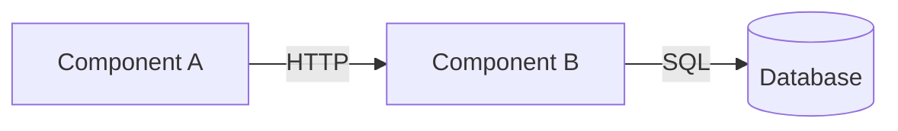

# ADR

Architecture Decision Records preserve the reasoning behind decisions across
time and team turnover. The code shows what got built — an ADR shows why this
option won, what was ruled out, and what trade-offs were accepted on purpose.

## When to use

Trigger phrases: "create an ADR", "write this up as an ADR", "document this
decision", "ADR for this", "this is ADR-worthy".

Write an ADR when:

- A non-obvious architectural choice was made (technology, boundary, protocol,
  data model, deployment topology)
- A trade-off was accepted on purpose and a future reader would otherwise
  reverse it without context
- A constraint forced a non-default choice (compliance, performance budget,
  legacy compatibility)
- The conversation surfaced alternatives that were considered and rejected

Skip the ADR when:

- The choice is local and reversible (variable naming, formatter config,
  test layout)
- It's a TODO or aspiration, not a resolved decision
- The "decision" is just following the existing pattern in the codebase
- It's already documented in code comments where the constraint lives

## Process

### Step 1: Detect the repo's ADR convention

First, check for an `.adr-dir` file at the repo root (adr-tools convention) —
it points at the ADR directory. If present, use it.

Otherwise, check in this order for an existing ADR directory:

1. `docs/architecture/adr/`
2. `docs/decisions/` (MADR default)
3. `docs/adr/`
4. `adr/`
5. `doc/adr/`
6. `architecture/decisions/`
7. `decisions/`

If found:

- Read 1–2 existing ADRs to detect the template structure, frontmatter format,
  numbering pattern (`0001`, `ADR-001`, date-based), and slug style
  (`kebab-case`, `snake_case`)
- Look for a `template.md` in the same directory and reuse it verbatim if
  present
- Match the existing convention exactly — consistency beats opinion
- Skip subdirectories named `archived/`, `superseded/`, `examples/`, or
  prefixed `_` when computing the next number; only count files matching the
  detected naming pattern

**Repo convention vs mandatory visualization — precedence:** The repo's
template wins for section names and order. Insert the Mermaid block into the
closest equivalent decision/outcome section (or `Context` for before/after
diagrams). If the repo template explicitly disallows diagrams or has no
sensible place for one, write `No diagram: follows repo ADR template` in
place of the visualization.

If not found:

- Use the opinionated default: create `docs/adr/` and use the MADR-inspired
  fallback template below
- Numbering: `0001-` zero-padded 4-digit sequential
- Filename: `NNNN-imperative-kebab-case-title.md`

### Step 2: Confirm this is actually a decision

Before writing, verify the input qualifies:

- **Is it resolved?** "We should consider X" is a TODO, not an ADR. Push back
  if the conversation didn't reach a clear conclusion.
- **Is it architectural?** Variable names and lint rules don't get ADRs.
  Boundaries, protocols, technology choices, and trade-offs do.
- **Is there a meaningful "why"?** Capture at least one of: an alternative
  considered, a rejected baseline, or a forcing constraint (compliance,
  vendor, migration, safety, compatibility). A "constraint-forced
  non-choice" is one of the most valuable ADR types — explain *why* the
  apparently odd constraint was accepted, even if no realistic alternative
  survived. The status-quo "do nothing" option is a valid alternative if
  applicable.

If the input fails the "resolved" or "architectural" gates, tell the user
and don't write the ADR. If alternatives are absent, write the ADR with the
constraint that forced the call (and use "Only viable option because
\<constraint>" in Decision Outcome).

### Step 3: Gather inputs

**From the conversation, without re-asking:**

- The decision being made
- Alternatives that were discussed and rejected
- File paths, modules, or systems that were touched or referenced
- Constraints mentioned (deadlines, compliance, performance, compatibility)
- Tickets, prior ADRs, or external docs that came up

**Ask the user only for what's missing or unclear:**

- A clear imperative title ("Use Postgres for primary store" — not "Database
  decision")
- The final decision wording (the one-line outcome)
- The **negative** consequences and trade-offs — these are usually understated
  in chat and are the most valuable part of the ADR
- Status: usually "Proposed" unless the decision is already shipped, in which
  case "Accepted"

Don't fabricate alternatives that weren't actually considered. Don't invent
constraints that weren't mentioned. If a section would be guesswork, leave it
short and honest rather than padding it.

### Step 4: Add a visualization (default ON)

**Every ADR includes at least one Mermaid diagram by default.** The whole
point of an ADR is to give a future reader the mental model — and a diagram
does that faster than three paragraphs of prose. Use the `viz` skill for
technique and templates.

Pick the diagram type from what the decision is *about*:

| Decision is about… | Diagram |
|---|---|
| Service / module boundaries, what calls what | C4 Container (`flowchart` with `subgraph`) |
| Protocol, RPC, async message flow | `sequenceDiagram` |
| Lifecycle, status transitions | `stateDiagram-v2` |
| Data model, relationships | `erDiagram` |
| Control flow, decision logic | `flowchart` |

Place the diagram in **Decision Outcome** (the "after" state). For decisions
that change an existing structure, also put a "before" diagram in **Context**
so the reader sees what changed.

**Skip the diagram only when one of these is genuinely true** (and say so
explicitly in the ADR — write "No diagram: <reason>"):

- The decision is purely textual or policy (e.g. "use UTF-8 everywhere",
  "all timestamps in UTC")
- The decision is a version pin or single-library swap with no structural
  change
- The decision is a deletion of a single component (the diagram would be
  empty)
- The decision is about a single function or data field with no system
  context

If you find yourself reaching for the exception list, prefer to draw
something small over skipping. A 3-node diagram beats no diagram.

### Step 5: Write the ADR

Compute the next number from existing files. Use the imperative title as the
slug. Write the file.

If using the repo's existing template, fill it in. If using the MADR fallback,
use the template below.

### Step 6: Report next steps

Print:

- The file path
- The proposed conventional commit message (`docs(adr): add ADR-NNNN <title>`)
- Any candidate index/overview file that might want a link: check
  `docs/architecture/README.md`, `docs/architecture/index.md`,
  `docs/adr/README.md`, `docs/decisions/README.md`, the repo root
  `README.md`, and (if MkDocs) `mkdocs.yml`'s nav. Suggest the most
  specific match, not all of them.

Do **not** auto-commit. The user reviews and commits.

## MADR-inspired fallback template

When no repo template exists, write the template below. It is *inspired by*
MADR v3.0 (https://adr.github.io/madr/) but deviates in three places, all
in service of staying lean:

1. Omits MADR's stakeholder frontmatter fields (`decision-makers`,
   `consulted`, `informed`) — usually noise in small-team / agent-driven
   contexts.
2. Splits Consequences into nested Positive/Negative buckets instead of the
   merged `Consequences` block with `Good, because` / `Bad, because` /
   `Neutral, because` lines that MADR 3.0 introduced.
3. Drops the `Pros and Cons of the Options` section entirely. It overlaps
   with `Decision Drivers` + `Decision Outcome` and is the most common
   bloat magnet — when there are 3+ options needing real comparison, add
   it back; otherwise the option names + outcome justification are enough.

If you want strict MADR fidelity, add the stakeholder fields, reshape
Consequences, and re-add the Pros and Cons section.

```markdown
---
status: Proposed
date: YYYY-MM-DD
tags:
---

# ADR-NNNN: <imperative title>

## Context and Problem Statement

<2–4 sentences. What forced this decision? What's the problem we're solving?
Reference the constraint, ticket, or incident that prompted it. Link affected
components by full path.>

## Decision Drivers

- <constraint or quality attribute, e.g. "must support 10k req/s">
- <e.g. "minimize ops surface — small team">
- <e.g. "keep migration reversible for 30 days">

## Considered Options

1. <Option A — short name>
2. <Option B — short name>
3. <Option C — short name>

## Decision Outcome

Chosen option: **<Option N>**, because <one-sentence justification anchored
to the strongest decision driver>.

### Visualization

<Required by default. Pick one diagram type that matches the decision (see
the `viz` skill for technique). Most ADRs land on a Container or Sequence
diagram. If you genuinely don't need one, replace this block with
`No diagram: <reason>` and move on.>



### Consequences

- **Positive:**
  - <what this enables / improves>
  - <what risk this avoids>
- **Negative:**
  - <what we accept as cost — be specific>
  - <what flexibility we give up>
  - <what could bite us later and under what conditions>

### Confirmation

<How will we know this decision is working? Metric, test, observation, or
"revisit if X happens".>

## More Information

- Affected components: `path/to/file.py`, `path/to/module/`
- Related ADRs: ADR-XXXX
- Related tickets: <KEY-123>
- External references: <links>
```

## Rules

- **Lean by default.** Target ~300–400 words of prose, plus one diagram. If
  it's longer, you're documenting the discussion, not the decision. Cut.
- **An ADR is not a conversation dump.** Distill what was decided and why,
  not how the conversation unfolded. No quotes, no chronology, no recap of
  the design discussion. The reader doesn't need the journey, they need
  the destination.
- **Code is truth.** If the ADR contradicts the source, fix the ADR or
  supersede it — never the other way around. `Accepted` status implies the
  decision is reflected in the current code.
- **Every node and edge in the diagram must be evidenced.** Trace each one
  to a real file, service, or explicit user statement. No invented
  components.
- **One decision per ADR.** If you find yourself writing "and also we
  decided to…" — that's a second ADR.
- **Imperative titles.** "Use X for Y", not "X adoption" or "Decision on Y".
- **Always include a Mermaid diagram.** A diagram is the fastest way to
  hand a future reader the mental model. Skip only when one of the narrow
  exceptions in Step 4 applies, and say so explicitly. See the `viz` skill
  for technique and templates.
- **The negative consequences section is the most valuable.** A future
  reader asking "why did they do this?" needs to see the trade-offs that
  were accepted on purpose. Don't soften them.
- **Link to code, don't restate it.** Full paths to affected components.
  Don't paste code blocks unless the snippet itself is the decision.
- **Status is a lifecycle, not a label.** `Proposed` → `Accepted` →
  `Deprecated` or `Superseded by ADR-NNNN`. Don't edit Accepted ADRs to
  reverse them — write a new one that supersedes.
- **No AI/co-author trailers in the file or commit.** Matches the user's
  global git policy.

## Anti-patterns

- **Dumping the conversation.** Quoting Slack threads, reproducing the
  chat that led to the decision, or narrating "first we considered X, then
  John said Y, then we realized Z." The ADR is the *output*, not the
  transcript.
- **Reproducing rejected proposals in detail.** Name the alternative, give
  one line on why it lost, move on. Don't paste the rejected design.
- **Including implementation steps.** "Phase 1: do X. Phase 2: do Y." That
  belongs in `scope`, not an ADR.
- **Inventing components, services, or protocols** not evidenced by the
  repo or conversation.
- **Writing an ADR for a decision that was never actually made.**
  Fabricated decisions are worse than no record.
- **Padding alternatives with options nobody considered**, just to fill the
  template.
- **Vague consequences:** "may have performance implications" → be specific
  or delete the line.
- **Documenting *what* the code does** instead of *why* this option won.
- **Writing ADRs for trivial or already-obvious choices.**
- **Restating the codebase:** an ADR is not architecture documentation,
  it's a decision record.
- **Editing an Accepted ADR to flip the decision** instead of superseding
  it.

## Boundary with other skills

- **`viz`**: the technique for drawing the diagrams every ADR includes by
  default. ADR is the container, viz is the diagrammer.
- **`scope`**: plans how to implement. **`adr`**: records why this approach
  was chosen over alternatives. Often used together — scope a phase, then
  ADR the architectural choices the scope assumed.
- **`code-review`**: reviews the implementation. ADRs are referenced by
  reviewers when invariants are at stake.
- **`collab`**: multi-agent design discussion. The output of a collab session
  often becomes one or more ADRs.

## Notes on detection edge cases

- If multiple ADR directories exist (rare), prefer the deepest one under
  `docs/` — it's usually the live one.
- If existing ADRs use a non-MADR format (e.g. Nygard's original 4-section
  format), match that format exactly. Don't impose MADR.
- If the repo has ADRs but no `template.md`, infer the template by reading
  the most recent ADR and reproducing its sections.
- If the repo has a CONTRIBUTING.md or AGENTS.md with explicit ADR rules,
  follow those over the detection defaults.
