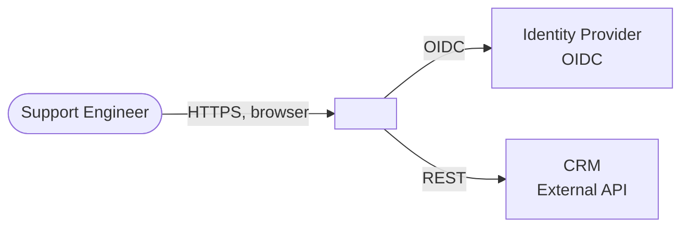
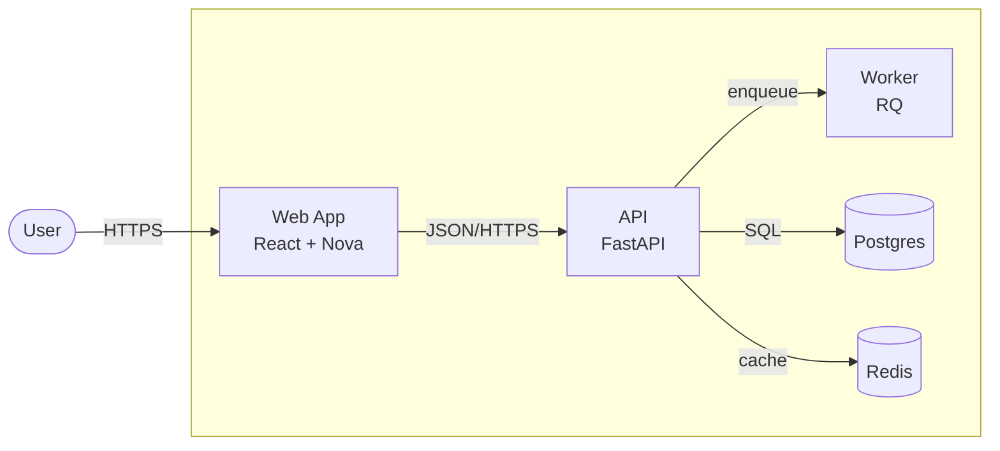
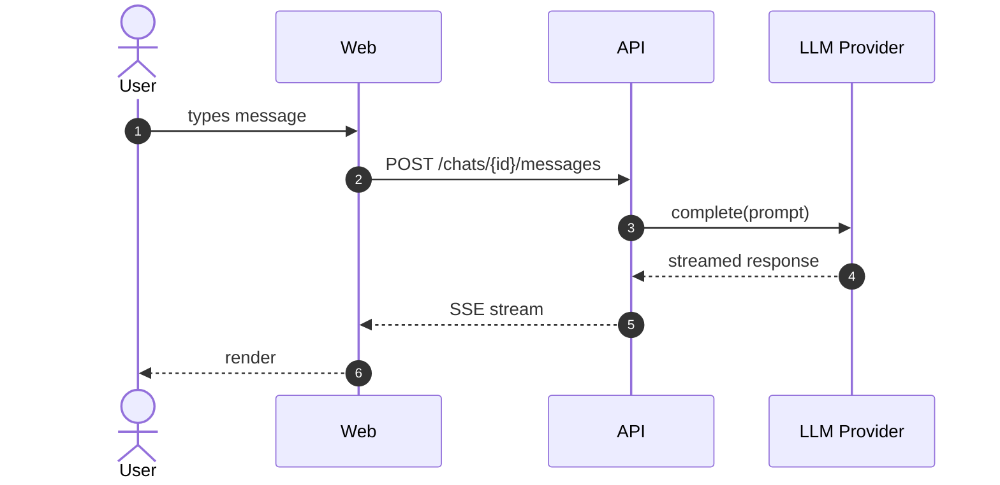
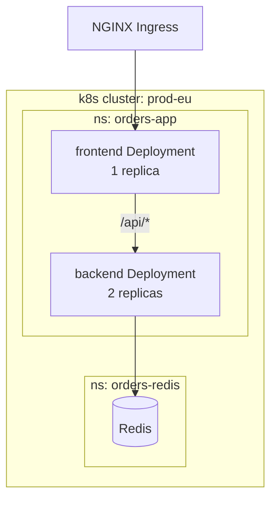
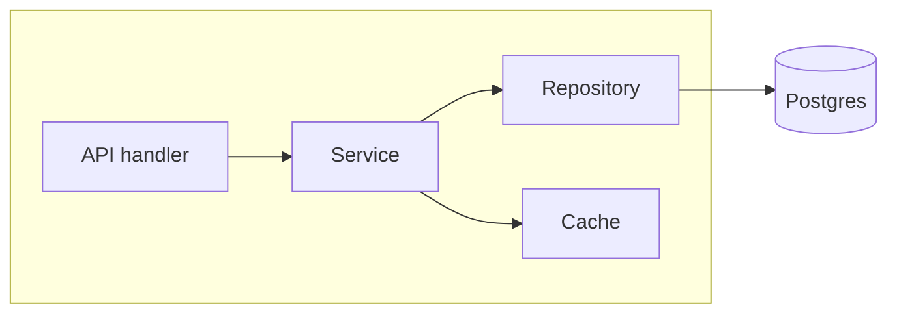

# Arch Docs

Living architecture documentation. Describes the *current* system: what
exists, how it's composed, how it runs, what trust boundaries it has, and
what invariants must not break. Evolves with the code. Reviewable in PRs.

Three things `arch-docs` is **not**:

- An ADR. ADRs capture frozen *decisions* and their rationale. Architecture
  docs describe *current state*. Link, don't duplicate.
- Agent orientation. `CLAUDE.md` / `AGENTS.md` tells an agent how to work
  in the repo (commands, conventions, gotchas). `arch-docs` tells anyone
  what the system *is*.
- A tutorial or how-to. Architecture docs are Diátaxis Explanation +
  Reference. Tutorials and runbooks live elsewhere.

## When to use

Trigger phrases: "document the architecture", "create/update arch docs",
"ARCHITECTURE.md", "system overview", "C4 diagram for this repo".

Use when:

- A repo has no architecture documentation and the system is non-trivial
  (more than a single file or single-purpose CLI)
- An existing arch doc is stale (`arch:watch` paths have moved on, or
  prose references files that no longer exist)
- A new subsystem/bounded context just stabilized and deserves an L3 zoom
- A trust boundary, deployment topology, or external integration changed

## Process

### Step 1: Detect convention and recon evidence

Detect existing docs setup:

1. Check the repo for **explicit conventions** first — `CONTRIBUTING.md`,
   `AGENTS.md`, `CLAUDE.md`, `docs/AGENTS.md`, `mkdocs.yml`,
   `docusaurus.config.*`. If they prescribe a docs layout, follow it.
2. Look for existing architecture docs in this order. **Do not treat
   bare `docs/` as the arch-doc root** — it usually holds product docs,
   API reference, or generated site sources, and writing into it
   blindly will corrupt unrelated content.
   - `docs/architecture/` (most common)
   - `docs/arch/`
   - `architecture/`
   - top-level `ARCHITECTURE.md`
   - Inside `docs/`, look only for architecture-named entries:
     `docs/architecture.md`, `docs/system-design.md`,
     `docs/system-overview.md`. Other `docs/` subdirectories are not
     architecture docs unless explicitly named.
3. If both `docs/architecture/` and top-level `ARCHITECTURE.md` exist,
   treat the top-level as an entry point unless it clearly is the live
   doc.
4. **Never write to** generated/build folders: `site/`, `public/`,
   `dist/`, `build/`, `.docusaurus/`, `_site/`, `node_modules/`.
5. Default fallback (no convention, no existing docs): create
   `docs/architecture/README.md` and, when warranted,
   `docs/architecture/subsystems/<name>.md`.

Recon the actual code/config before writing:

- List the subsystems / packages / modules at the repo top level
- Find the deployment manifests (Dockerfile, k8s/Helm, `serverless.yml`,
  `*.tf`, `compose.yml`)
- Find the entry points (`main.py`, `index.ts`, `cli.py`, `cmd/`)
- Find external integrations (HTTP clients, SDK imports, MCP servers,
  message queues, databases)
- Find the auth/trust boundaries (auth middleware, JWT verification, CORS
  config, network policies)

Cite evidence in your output. Architecture docs must be **evidence-backed**:
every node and edge in a diagram traces to a real file, service, or config.
No invented infrastructure.

### Step 2: Decide doc shape

Pick the smallest shape that fits:

- **Overview only** — one `README.md` (or `ARCHITECTURE.md`). Default for
  small/medium repos, libraries, single-service apps.
- **Overview + subsystems** — when the system has 2+ stable bounded
  contexts that each warrant their own L3 zoom. Subsystem files live in
  `docs/architecture/subsystems/<name>.md`.
- **Overview + invariants** — add `docs/architecture/invariants.md` (or
  preserve an existing `agent-context.md`) when there are repo-wide rules
  that aren't obvious from grepping the code (cache TTLs, ordering
  guarantees, idempotency contracts, regulatory invariants).

Subsystem rule: a subsystem doc maps to a **bounded context / ownership
boundary**, not mechanically to a C4 Container. One deployable can host
several subsystems; one subsystem can span multiple deployables. Create a
subsystem doc only when the L3 component zoom is non-obvious AND the
overview's L2 view doesn't carry it.

### Step 3: Write or update the docs

Use the templates in this skill (overview, subsystem, invariants) as the
starting point. Adapt sections to what the repo actually has — don't
invent sections you can't fill with real content.

If updating an existing doc, **preserve its current structure** unless
the user explicitly asks to restructure. Match the existing tone and
section names.

### Step 4: Add `arch:watch` markers and run staleness check

Every architecture doc gets a marker at the bottom listing the source
paths it documents:

```markdown
<!-- arch:watch
- src/orders/service/**
- src/orders/resource/**
- dev.config.yaml
- helm/values.yaml
-->
```

Globs and directories are allowed. Watch the **smallest set** that, if
changed, would invalidate the doc.

Staleness check (run on every invocation in a repo with existing arch
docs):

1. **Soft signal — git history.** For each doc, compare the last commit
   touching any watched path vs the last commit touching the doc. If
   watched paths moved on, warn.

   For each entry in `arch:watch`:

   a. **Literal path or directory** (e.g. `dev.config.yaml`,
      `src/orders/service`):
      ```bash
      git log -1 --format=%ct -- <path>
      ```

   b. **Glob pattern** (e.g. `src/orders/service/**`,
      `helm/values-*.yaml`): expand against tracked files first, then
      compare. Don't pass globs directly to `git log` — shell expansion
      is unreliable.
      ```bash
      git ls-files -- 'src/orders/service/**'
      # then run git log against the resulting list, or against the
      # common parent directory:
      git log -1 --format=%ct -- src/orders/service
      ```

   c. **Watched path that doesn't match any tracked file**: report as
      `arch:watch entry "<pattern>" matched no tracked files` — likely
      stale marker (path was renamed/deleted). Don't silently skip.

   d. **Untracked watched path that exists on disk** (e.g. a generated
      file watched intentionally): report as `untracked watched path,
      git history unavailable` — exclude from the timestamp comparison
      but acknowledge in the report.

   Then compare the doc's last commit time:
   ```bash
   git log -1 --format=%ct -- docs/architecture/README.md
   ```

   Warn (don't block) when any watched path's last-commit time is more
   recent than the doc's last-commit time.

   Do **not** use filesystem mtimes — they break on clone, checkout,
   rebase, branch switches, and don't survive shallow clones.

2. **Hard signal — broken references.** Scan the doc's prose and Mermaid
   diagrams for references that no longer exist:
   - **Path references** (any token matching a file path pattern, e.g.
     `src/orders/foo.py`, `docs/adr/0007-*.md`): use `git ls-files`
     to verify each path exists. Hard-flag missing paths.
   - **Service / component references** (a node in a diagram that isn't
     a path): require the node to be evidenced by one of:
     deployment manifests (`*.yaml` in `k8s/`/`helm/`/`compose*.yml`),
     a package/workspace name in `package.json`/`pyproject.toml`/
     `Cargo.toml`, an entrypoint module, an SDK import (`import
     anthropic`, `boto3.client('s3')`), an env var key (`STRIPE_KEY`),
     or explicit user input. If a node has no such evidence, flag as
     "unverified component" — either label it `external` and tie to
     its evidence (SDK/env/config), or remove it.

   Hard signals require fixing the doc or escalating to the user — they
   indicate real rot, not just timing drift.

### Step 5: Validate and report

Before finishing:

- Validate Mermaid in this order; report which level was reached:
  1. If `mmdc` (mermaid-cli) is on PATH, render each block to a temp
     file. Hard-flag syntax errors.
  2. Else if a docs build exists and renders Mermaid (MkDocs with
     `mermaid2`, Docusaurus, etc.) and runs in under ~30s, run it.
  3. Else fall back to static checks: every fenced block opens with
     ` ```mermaid` and closes; no `LR`/`TD`/`BT` direction in
     `sequenceDiagram` blocks (sequence diagrams ignore those — see
     `viz` skill); each `flowchart` declares a direction.
- Check that every path mentioned in `arch:watch` actually exists (or
  matches a tracked file via `git ls-files` for globs)
- If the repo has a docs build (MkDocs, Docusaurus), suggest running it;
  don't run it automatically unless trivially fast
- Report:
  - Files created/updated
  - Watched paths and any stale warnings
  - Suggested next steps (link from `AGENTS.md`/`README.md`, link related
    ADRs, MkDocs nav update if applicable)
  - Anything you couldn't validate

Do **not** auto-commit. The user reviews and commits.

## Overview template (`README.md` or `ARCHITECTURE.md`)

Target ~200 lines, hard cap 350. If you exceed, split into subsystem
files.

```markdown
# <System name>

> **Status:** Current — last verified <YYYY-MM-DD>

<One paragraph: what this system is, who uses it, what problem it solves.
2-4 sentences. Be specific — "order intake service for warehouse operators"
beats "generic e-commerce platform".>

## 1. Introduction & Goals

### Scope and audience

<What's in scope (this system) and out of scope (linked systems we depend
on but don't own). Who reads this doc — engineers joining the team,
operators on call, security review.>

### Architecture drivers and constraints

Top quality attributes and constraints driving the architecture. Be
specific:

- **<Driver 1>** — e.g. "p95 latency < 2s for chat responses"
- **<Driver 2>** — e.g. "auditability: every LLM call traced to user"
- **<Driver 3>** — e.g. "tenant isolation: no cross-tenant data leakage"
- **<Constraint 1>** — e.g. "must run in our k8s cluster, no external
  SaaS for primary data path"
- **<Constraint 2>** — e.g. "data residency: EU only"

### Non-goals

- <Thing we explicitly chose not to do, with one-line reason>

## 2. System Context (C4 L1)

<One paragraph framing: actors, external systems, what crosses the
boundary.>



**Library / package exception:** if the artifact is a library or SDK with
no runtime boundary, replace System Context with a "Consumer Context"
component diagram showing how consumers integrate, or write
`No L1: library package; consumers and integration points covered in
Building Blocks`.

## 3. Building Blocks (C4 L2)

<One paragraph: how the system decomposes. Reference each container by
name and one-line responsibility.>



For each container, one paragraph or bullet list:

- **<Container A>** — responsibility, key tech, where the code lives
  (full path). Owns: <data/contracts it owns>. External deps: <SDK,
  service>.
- **<Container B>** — …

If a container deserves an L3 zoom, link to its subsystem doc:
`See [<Subsystem A>](subsystems/subsystem-a.md)`.

## 4. Runtime Scenarios

2-3 critical flows. Sequence diagrams.

### <Scenario 1: e.g. "User sends a chat message">



<2-3 sentences explaining what's interesting about this flow — what's
synchronous vs streamed, where the trust boundaries are, what invariant
this protects.>

## 5. Deployment View

<One paragraph: where it runs, what runtime/cluster, what zones.>



**Skip if not applicable:** for libraries, write
`No deployment view: library distributed via PyPI/npm; consumer-deployed`.

## 6. Cross-cutting Concerns

Pick the subset that matters for this system. Don't pad — empty sections
are noise.

### Security and trust boundaries

<Auth: how requests are authenticated. Authz: how access is decided.
Mark trust boundaries on the L1/L2 diagrams when relevant. Where secrets
live and who can read them.>

### Data ownership and lifecycle

<Who owns which data. Where PII/secrets live. Retention. Backup/DR.
Cross-tenant isolation if multi-tenant.>

### Observability and operations

<Tracing/metrics/logs platforms. SLOs if defined. Failure modes and
their detection. Rollback/recovery procedure (one-line — link to runbook
for detail).>

### Error handling and resilience

<Retry/backoff policies. Circuit breakers. Idempotency contracts.
Behavior when a dependency is down.>

### Current risks and known trade-offs

This is the architecture-debt section. Be honest:

- **<Risk 1>** — what's brittle today and why
- **<Trade-off 1>** — what we accepted on purpose, with the constraint
  that forced it (link to ADR if one exists)

## Relevant decisions

<Bullet list of related ADRs. Link only — do not repeat the rationale.>

- [ADR-0007: Use Postgres for primary store](adr/0007-use-postgres.md)
- [ADR-0012: File upload pipeline](adr/0012-file-upload.md)

## Related docs

- [Invariants](invariants.md) (when present)
- [Subsystem zooms](subsystems/) (when present)
- [Operations runbook](../ops/runbook.md) (link, don't merge)

<!-- arch:watch
- src/<your-package>/**
- helm/**
- dev.config.yaml
- mcp.json
-->
```

## Subsystem template (`subsystems/<name>.md`)

Target ~150 lines, hard cap 250.

```markdown
# Subsystem: <Name>

> **Status:** Current — last verified <YYYY-MM-DD>

<One paragraph: what this subsystem owns, what bounded context it
represents, who its consumers are.>

## Responsibility

<2-4 bullets. What this subsystem is responsible for, and equally
important — what it explicitly is not.>

## Components (C4 L3)



For each component: one bullet with file path and responsibility.

## Contracts and interfaces

What the subsystem exposes to the outside. Be specific:

- **HTTP**: `POST /api/uploads`, `GET /api/uploads/{id}` —
  `src/api/routers/uploads.py`
- **Events emitted**: `upload.verified`, `upload.failed`
- **Storage owned**: `uploads` table, `attachments/` blob prefix
- **Auth boundary**: requires authenticated user + `uploads:write` role

## Local runtime scenarios

Subsystem-specific flows that don't fit at L2.

## Invariants and contracts

What must not break. e.g. "uploads are idempotent on `client_id`",
"sidecar `.md` is always written before the user-visible path returns
200".

## Current risks and known trade-offs

<Be honest about what's brittle in this subsystem.>

<!-- arch:watch
- src/<your-package>/<subsystem>/**
-->
```

## Invariants template (`invariants.md`)

Short, dense, opinionated. Things you can't grep for. Each invariant gets
3-5 lines.

```markdown
# Invariants

Repo-wide rules and gotchas that aren't obvious from reading the code.
Each entry: the rule, why it exists, where it bites if violated.

## <Invariant 1: e.g. "All timestamps are UTC and timezone-aware">

- **Rule**: every datetime emitted across an API boundary or stored in
  Redis is `datetime.now(timezone.utc)`.
- **Why**: we had a frontend bug shipping naive UTC strings as local
  time.
- **Where it bites**: `src/chat/stores.py`, anything serialized to
  Redis or sent over SSE.

## <Invariant 2: …>
```

## Optional addendum: AI systems

This addendum is **opt-in**. Add it only when recon finds at least one
of these unambiguous signals (or two weak signals):

**Strong signals (one is enough):**
- LLM/agent SDK imports: `anthropic`, `openai`, `litellm`, `langchain`,
  `langgraph`, `@anthropic-ai/sdk`, `openai-agents`, `instructor`
- An MCP config file: `mcp.json`, `.mcp.json`
- A `.github/agents/`, `agents/` directory with `*.agent.md` files, or
  a `skills/` directory with `SKILL.md` files
- Langfuse, Helicone, Arize Phoenix, or W&B Weave SDK imports
- A model gateway or router (e.g. LiteLLM proxy, Bedrock/Vertex SDKs in
  inference-path code, not just infra)

**Weak signals (need two together):**
- A `prompts/` directory or `*.prompt.md` files (could be UI/shell
  prompts in non-AI repos)
- Mentions of "agent", "tool calling", "retrieval", "embedding" in code
  comments or docs
- A vector DB client (`pinecone`, `weaviate`, `qdrant`, `chroma`,
  `pgvector`)

Do **not** add the addendum just because the word "prompt" appears in
the codebase. Generic prompt files in shell tools, UI code, or
documentation are not AI-system signals.

If the system is AI-related, add this section to the overview:

```markdown
### AI architecture

- **Models and providers**: which models, which providers, where the
  model selection lives.
- **Prompt sources**: where system prompts come from (file, DB, agent
  config). Versioning policy.
- **Tool / MCP boundary**: which MCP servers are reachable, what
  credentials they hold. Reference the MCP config file.
- **Evaluation and guardrails**: how outputs are validated, where
  rejection logic lives.
- **Tracing and cost observability**: where traces go (Langfuse,
  OpenTelemetry), how cost is computed.
- **Data retention**: what user input is retained where, for how long.
```

This section is **opt-in** — only add it when the repo actually has AI
components. For non-AI repos, it's noise.

## Mermaid conventions for arch-docs

(See the `viz` skill for full technique.)

- Use **`flowchart` with `subgraph`** for C4 diagrams. Mermaid has a C4
  beta syntax — don't use it unless the repo already does. Flowchart is
  more portable and widely renderable.
- Cap each diagram at ~15 nodes. If you need more, you're at the wrong
  zoom level — split.
- Label every edge with the protocol or intent (`HTTPS`, `SQL`,
  `enqueue`, `OIDC`).
- Mark trust boundaries with `subgraph` named after the boundary
  (e.g. `subgraph dmz [DMZ]`, `subgraph internal [Internal network]`).

## Rules

- **Code is truth.** If the doc contradicts the source, fix the doc or
  supersede it. Never the other way around.
- **Evidence-backed.** Every node, edge, and prose claim traces to a
  real file, service, or config. List the files you inspected when
  reporting.
- **Current state only.** Planned features go to roadmap or scope
  documents, not architecture docs. If documenting a migration in
  progress, label `Current` and `Target` explicitly.
- **Lean by default.** Overview ~200 lines (350 hard cap). Subsystems
  ~150 (250 hard cap). Diagrams ≤15 nodes. Runtime scenarios ≤3.
- **Include diagrams by default.** L1 (or Consumer Context for
  libraries), L2, Deployment (when applicable), and up to 2-3 sequence
  diagrams for critical flows. Per `viz` skill rules. Library/SDK
  escapes (`No L1: library package`, `No deployment view`) defined in
  the overview template above are valid; use them, don't ignore them.
- **Diátaxis boundary.** Architecture docs are Explanation + Reference.
  No tutorials, no how-to, no runbooks inline. Link to those if they
  exist elsewhere.
- **ADR linkage rule.** Link related ADRs; do not repeat the decision
  rationale. If current architecture contradicts an Accepted ADR, flag
  it and suggest a superseding ADR.
- **Status field discipline.** A doc is `Current`, `Migrating to X`, or
  `Stale`. If you can't honestly mark it `Current`, fix it or note the
  gaps.
- **No AI/co-author trailers** in commits or files. Matches the user's
  global git policy.

## Anti-patterns

- **Auto-generated UML/class diagrams from code.** Nobody reads them,
  they don't capture what matters. Reference OpenAPI/protobuf specs,
  don't dump them inline.
- **Architecture-as-wiki.** Docs that read like a tour ("first this
  happens, then that…") instead of a reference. Architecture docs are
  for skimming and lookup, not narrative.
- **Mega-doc.** Everything in one 1500-line file. Split by bounded
  context.
- **Aspirational drift.** Documenting features that aren't merged yet.
  If it's not in the code, it's not architecture.
- **Diagram spam.** A diagram per paragraph. Use a diagram when it
  carries information prose can't.
- **Inventing components.** A box on the diagram that has no
  corresponding code or config.
- **Stale doc shipping.** Updating one section while leaving the rest
  contradicting current code. If you touch a doc, run the staleness
  check on the whole file.
- **Documenting trivial structure.** "The `utils/` folder contains
  utility functions" — not architecture, just labels.
- **Using diagrams to leak topology** for public docs. Internal
  hostnames, IPs, network ranges, customer flows in a public README is
  a security smell.

## Boundary with other skills

- **`adr`**: frozen decisions and why they were made. Link from arch
  docs, don't repeat. If architecture contradicts an Accepted ADR,
  that's an ADR-superseding event.
- **`viz`**: Mermaid technique. arch-docs is the *what to draw* and
  *where it lives*; viz is the *how to draw it*.
- **`scope`**: implementation plan for upcoming work. arch-docs is
  current state. A scoped change can refer to arch docs as "current"
  and describe the "target" — but the actual update to arch docs
  happens after the change ships.
- **`init` / `CLAUDE.md` / `AGENTS.md`**: agent orientation — how to
  work in this repo (commands, conventions, repo map). arch-docs:
  what the system *is*. Overlap is small: `AGENTS.md` may link to
  `docs/architecture/README.md` as a one-line "see also". arch-docs
  should not rewrite agent instructions.
- **`drawio-diagrams-enhanced`**: only when polished slide-ready
  output is needed for non-engineering audiences. Default for
  arch-docs is Mermaid.

## Notes on detection edge cases

- If a repo already has a docs framework (MkDocs, Docusaurus,
  Read the Docs), respect its file layout. Suggest a nav update only
  if the framework already uses a manual nav. Never introduce a docs
  framework as part of this skill.
- If `ARCHITECTURE.md` exists at the repo root and is short, update
  it in place. If it's already large, suggest splitting into
  `docs/architecture/` rather than letting it grow.
- If a repo's existing arch docs use a different framework (4+1,
  Nygard, freeform prose), match that style — don't impose
  arc42-lite. The skill's job is to make the docs better, not to
  migrate frameworks.
- If the user has only one application file (e.g. a single-script CLI
  tool), the architecture doc is the README. Don't create
  `docs/architecture/` for trivial repos.
