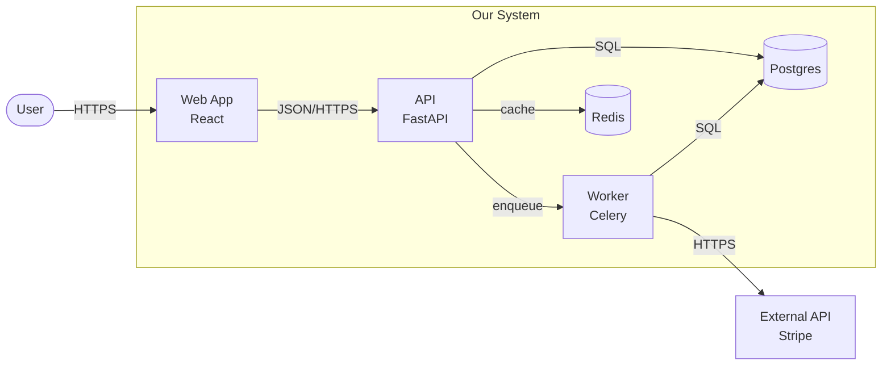
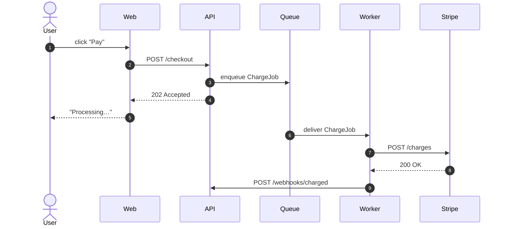
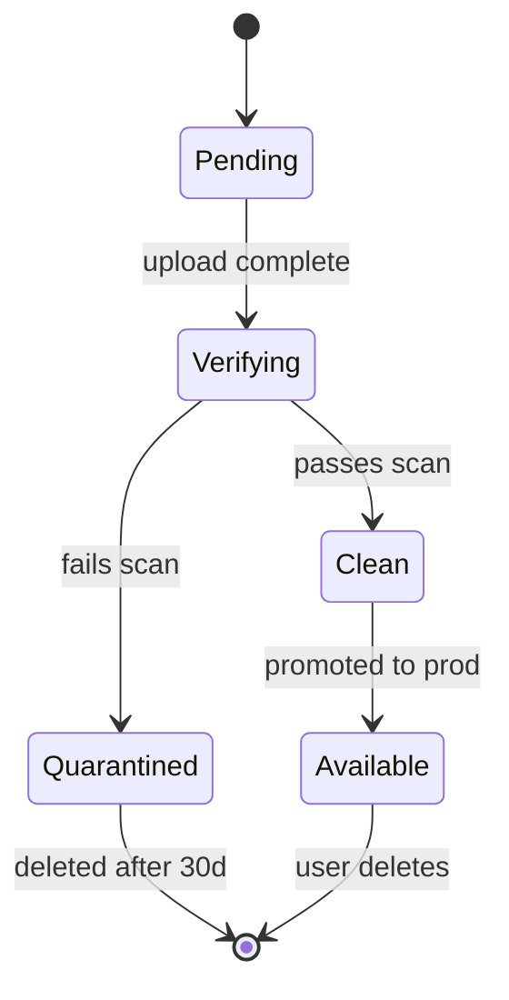
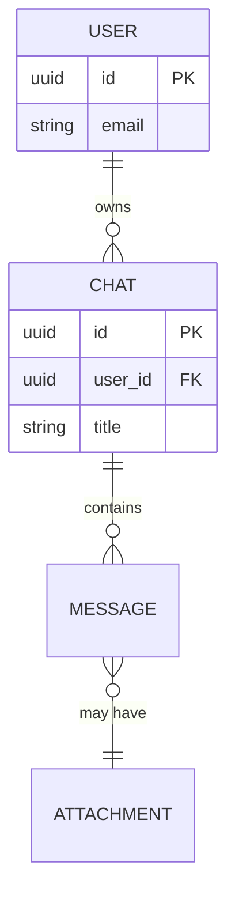
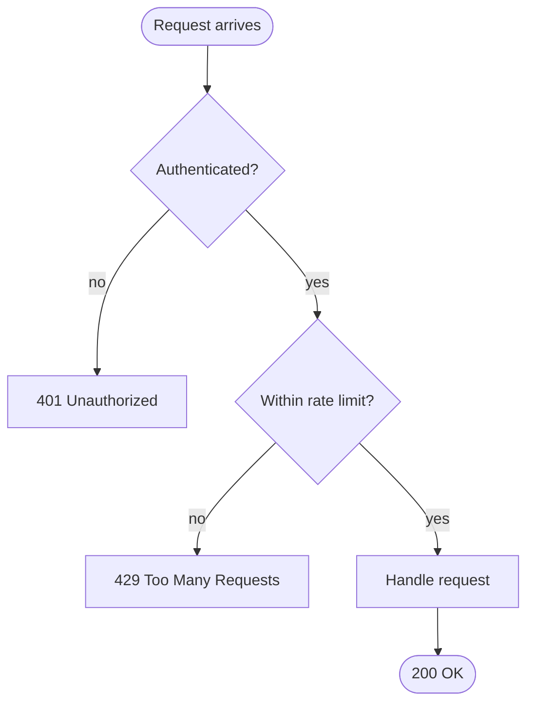
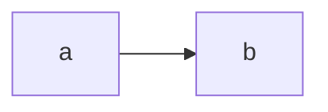

# Viz

Lightweight, pragmatic visualization for markdown documentation. Mermaid is
the default — it renders natively on GitHub/GitLab, lives inside the markdown,
and is trivially editable by humans and agents alike.

## When to use

- Adding a diagram inside an ADR, architecture overview, README, or runbook
- Sketching a quick flow during a design discussion
- Replacing prose paragraphs that describe structure or sequence with a
  diagram
- Anywhere the diagram needs to live next to the text, be diff-able, and
  survive without a toolchain

When **not** to use Mermaid:

- The diagram needs >15 nodes (split it, or use C4 zoom levels — see below)
- Pixel-perfect layout matters (a slide deck, a vendor pitch) → defer to
  `drawio-diagrams-enhanced`
- The visualization is data-driven (charts, dashboards) → not Mermaid's job
- The diagram would expose secrets, internal hostnames, private network
  ranges, customer-identifying flows, or non-public topology — unless the
  doc is explicitly internal. Diagrams leak structure more visibly than
  prose; treat them with the same care as logs.

## Pick the right diagram type

Don't agonize. Match the *thing being shown* to the diagram type:

| You are documenting… | Use | Mermaid keyword |
|---|---|---|
| System / service / module boundaries | C4 Container or Component | `flowchart` with `subgraph` |
| Deployment / runtime topology (k8s, cloud, network zones) | C4 Deployment-style | `flowchart` with nested `subgraph` |
| Request / RPC / async message flow | Sequence | `sequenceDiagram` |
| Lifecycle, state machine, status transitions | State | `stateDiagram-v2` |
| Data model, entities, relationships | ER | `erDiagram` |
| Branching control flow, decision tree | Flowchart | `flowchart` |
| Class hierarchy, interfaces, inheritance | Class | `classDiagram` |
| Project timeline, milestones | Gantt | `gantt` |
| Branching / release strategy | Git graph | `gitGraph` |
| User journey, UX flow | Journey | `journey` |

If you can't decide between flowchart and sequence: **flowchart for static
structure, sequence for what happens over time**.

## C4 model — the framework, not the tool

C4 is a way to pick the *zoom level*, not a Mermaid alternative. Use it to
decide what's in your diagram:

1. **System Context** — your system + external actors and systems. One box
   for "us". Use sparingly; usually obvious.
2. **Container** — runnable units inside your system: services, databases,
   queues, frontends. **This is where most ADR diagrams live.**
3. **Component** — pieces inside a single container. Useful when an ADR is
   about an internal boundary.
4. **Code** — class diagrams. Rarely worth drawing — read the code.

When in doubt for an ADR, draw the **Container** level. It captures the
"what talks to what and how" that decisions usually hinge on.

## Templates

### Container diagram (C4-style, in flowchart)



Notes:
- `[]` = rectangle (service), `([])` = rounded (actor), `[()]` = cylinder
  (database), `(())` = circle
- Label edges with the protocol or intent (`HTTPS`, `enqueue`, `SQL`) — that
  detail is usually what the ADR is about
- Use `subgraph` for trust/deployment boundaries

### Sequence diagram (protocol, async flow)



Notes:
- `autonumber` makes it easy to reference steps in prose
- Arrow semantics:
  - `->>` solid: synchronous request / call
  - `-->>` dashed: response / return value
  - `-)` solid open: asynchronous send / fire-and-forget (Mermaid 9+)
  - `--)` dashed open: async response
- `actor` for humans, `participant` for systems
- Sequence diagrams do **not** use `LR`/`TD`/`BT` direction modifiers — those
  are for `flowchart` only. Layout in sequence diagrams is controlled by
  the **declaration order** of `actor`/`participant` (left-to-right).

### State diagram (lifecycle)



### ER diagram (data model)



Notes:
- `||--o{` = one-to-many. `}o--o{` = many-to-many. `||--||` = one-to-one.
- Add fields only when the schema is the point of the diagram

### Flowchart (control flow / decision)



Direction modifiers (`flowchart` only — sequence diagrams ignore these):
`TD`/`TB` (top-down), `LR` (left-right), `BT`, `RL`. For request flows in a
flowchart, prefer `LR`; for hierarchies / decision trees, prefer `TD`.

## Embedding in markdown

Mermaid blocks render automatically on GitHub, GitLab, and most modern
markdown renderers. Just use a fenced code block with `mermaid` as the
language:

````markdown

````

For local preview: VS Code has the **Markdown Preview Mermaid Support**
extension. JetBrains IDEs render it natively in markdown preview.

## Rules

- **Diagram before prose, not after.** If you wrote three paragraphs about
  what calls what, replace them with a Container diagram.
- **Label the edges.** The arrow direction is the easy part — the *kind* of
  call (HTTP/gRPC/queue/SQL) is what readers come for.
- **One concept per diagram.** Don't combine a sequence diagram with a state
  machine because they share an actor.
- **Keep it small.** If you're past 15 nodes, the diagram is already wrong
  — split it, zoom out, or move detail into prose.
- **Match the diagram to the doc's lifespan.** ADRs live forever; don't put
  per-deploy specifics inside one.
- **No decoration.** Colors, fonts, line styles should encode meaning or
  not be used. Mermaid's defaults are fine.

## Anti-patterns

- **Inventing components, services, or protocols not evidenced by the
  repo or conversation.** A diagram that "looks plausible" but adds a
  fictional cache layer or message queue is worse than no diagram. Verify
  every node and edge against actual code or explicit user input before
  drawing it.
- Drawing a "kitchen sink" diagram with everything in the system on one
  page (use C4 zoom levels instead)
- Sequence diagrams for static structure (use flowchart)
- Flowcharts for clear sequences of system-to-system calls (use sequence)
- ASCII art for diagrams that should be Mermaid (ASCII doesn't render, doesn't
  scale, and is harder for agents to update)
- Polished `.drawio` files inside an ADR — version-controlled markdown is
  the wrong place for binary-ish XML
- Diagrams that just rephrase the surrounding text (the diagram should
  carry information the prose doesn't)
- Re-drawing the same diagram at multiple zoom levels in one doc when one
  level suffices

## Boundary with other skills

- **`adr`**: ADRs should include at least one diagram by default. This skill
  is the technique; ADR is the container.
- **`drawio-diagrams-enhanced`**: use when the output needs to be polished
  for non-engineering audiences (slide decks, vendor pitches, customer-
  facing architecture overviews). Mermaid is for engineering documentation.
- **`scope`**: scoping output is text-first. Add a diagram only when the
  phases or change surface span multiple systems.

## Quick reference: which Mermaid block, again?

```
flowchart       → structure, control flow, C4 container/component
sequenceDiagram → time-ordered interactions
stateDiagram-v2 → state machines, lifecycles
erDiagram       → data models
classDiagram    → class hierarchies (rarely worth it)
gantt           → schedules
gitGraph        → branching strategy
journey         → user journeys
mindmap         → brainstorming (don't put in production docs)
```
